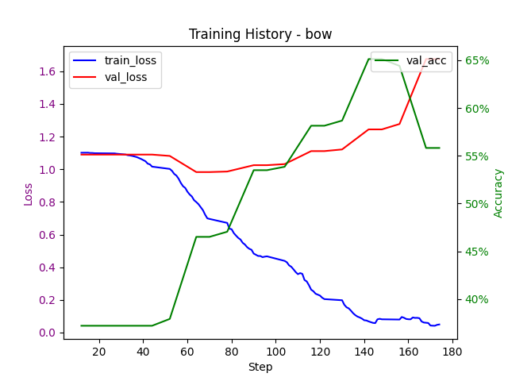
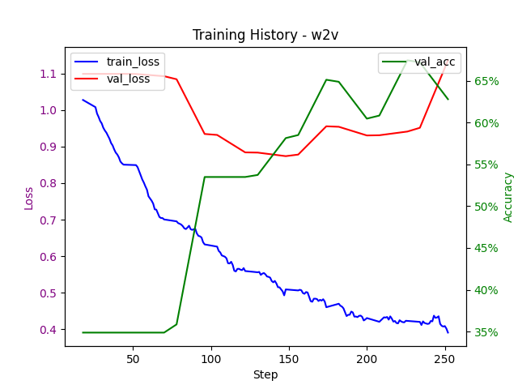
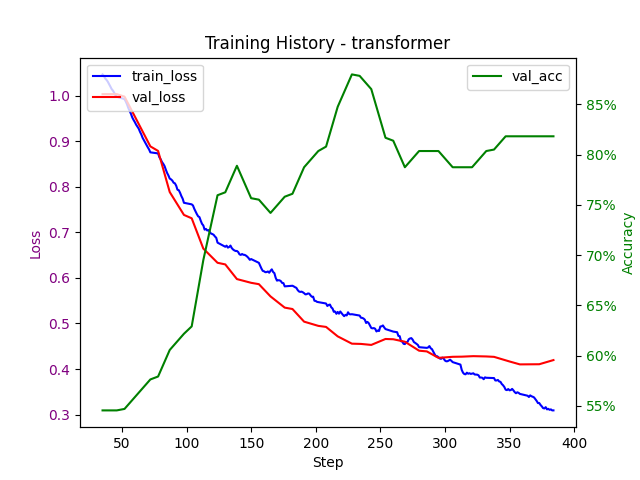

# Sentiment Analysis in Financial News

Model Weights:  
[https://github.com/rzimmerdev/sentiment-analysis/releases/latest](https://github.com/rzimmerdev/sentiment-analysis/releases/latest)  

## Task Description  

The task consists of performing sentiment analysis on a dataset of financial phrases.  
The goal is to classify each phrase as positive, negative, or neutral (three-class multi-class single-label classification) based on its emotional content.  
For this purpose, we used three different modeling approaches for comparison:  

- A **baseline** approach using Bag of Words (BoW).  
- A **state-of-the-art** approach using a pre-trained Transformer (BERT).  
- An **additional** approach utilizing Word2Vec.  

## Chosen Dataset  

The dataset chosen for this analysis is the **FinancialPhraseBank**, available on [Kaggle](https://www.kaggle.com/datasets/ankurzing/sentiment-analysis-for-financial-news).  

It is a relatively popular dataset used in financial sentiment analysis. This dataset contains phrases extracted from financial reports and mainly from news articles.  

It is relatively simple and preprocessed (to some extent, requiring additional transformations, especially for our models). It is also **not well-balanced** (59% positive, 28% neutral, and 12% negative).  
Therefore, **undersampling** was necessary to prevent model bias.  

---

# Adopted Approach  

For the **baseline approach**, we used a **Bag of Words (BoW) model**, which transforms each sentence into a word frequency vector, ignoring word order and context. This approach was introduced in lectures and is commonly used for simple problems with few classes or less complex data.  

For the **state-of-the-art (SOA) approach**, we chose a **Transformer-based model** that processes words in context, which is highly relevant for sentiment analysis (e.g., *"The economy is highly volatile, but Apple performed well."* - sentiment depends on whether we are referring to the market or the company).  

For the **additional approach**, we selected **Word2Vec** and used a **recurrent network (LSTM)** for classification. This approach serves as a middle ground between the two others while incorporating recurrent networks, another topic covered in class.  

---

## **Bag of Words (BoW)**  

Our implementation has two key components:  

- **Vectorization class**, which applies a frequency-based transformation to serve as input for classification.  
- **Classification model**, a fully connected neural network (linear weights) with a probabilistic output.  

This simple approach is based on **Bayes' theorem**, where frequency is used as the prior.  

  

---

## **Word2Vec**  

Word2Vec is more complex to implement than BoW due to the need to create a **latent embedding space** (vector representation of words).  

Our implementation includes a **vectorization method**, similar to BoW, but uses the **Gensim** library, which automatically creates the word embedding space based on existing sentences.  

  

---

## **Transformer with Transfer Learning**  

Transformers are deep learning models introduced in 2017, highly effective in **NLP** as they understand word context bidirectionally (before and after a given word).  

For our implementation, we used **Bert-Small**, a **lighter** version of BERT with the same architecture. We **froze the model’s weights** and added additional layers for classification, leveraging **transfer learning** to fine-tune it for our dataset.  

---

# **Specifications**  

## **Bag of Words (BoW)**  

There are two main approaches: **Continuous Bag of Words (CBOW)** and **Skip-gram**.  
- CBOW predicts a word based on its context.  
- Skip-gram does the opposite: predicting context based on a word.  

We implemented **CBOW**, as it is **more effective for our problem**, prioritizing context over individual words.  

After vectorization, we added **fully connected layers** (a standard DNN) as the classifier for sentiment labels.  

### **Hyperparameters:**  
- `input_dim=2000`  
- `hidden_layers=6`  

### **Training Arguments:**  
- `max_epochs=50`  
- `batch_size=64`  
- `num_workers=8`  
- `lr=1e-4`  

---

## **Word2Vec (W2V)**  

For W2V, we used the **Gensim** library to generate word embeddings.  

In this approach, we incorporated an **LSTM layer (Long Short-Term Memory)**, forming a **recurrent network** alongside linear layers (receiving CBOW output).  

### **Hyperparameters:**  
- `hidden_size=1024`  
- `hidden_layers=6`  

### **Training Arguments:**  
- `max_epochs=50`  
- `batch_size=64`  
- `num_workers=8`  
- `lr=1e-4`  

---

## **Transformer (Transfer Learning using Bert-Small weights)**  

**BERT (Bidirectional Encoder Representations from Transformers)** is a **Google-developed** Transformer model designed for NLP.  
We chose a **lighter** version with fewer weights but the same architecture.  

BERT captures **word context bidirectionally**, enabling it to infer meaning based on surrounding words. This makes it highly effective for **NLP tasks and transfer learning**.  

We **froze the Bert-Small model weights** and added additional trainable layers.  

### **Hyperparameters:**  
- `hidden_layers=3` (only the unfrozen layers)  

### **Training Arguments:**  
- `max_epochs=50` (training takes longer)  
- `batch_size=64`  
- `num_workers=8`  
- `lr=1e-4`  

---

## **Results**  

All results are available in the [`results`](results) folder.  

To compare models, we implemented a function to **load trained weights** and calculate **evaluation metrics**, including:  

- **Accuracy**: Percentage of correct predictions.  
- **Confusion Matrix**: Shows correct and incorrect classifications.  
- **F1 Score**: Weighted average of precision and recall.  
- **Log Loss**: Logarithmic loss function.  
- **AUC**: Area Under the ROC Curve.  
- **AIC**: Akaike Information Criterion.  

Comparing all three models:  

- **Transformer achieved the highest accuracy and F1 Score.**  
- **Word2Vec performed the worst**, likely due to **lack of tokenization/stopword removal**, whereas Transformer used **pretrained embeddings**.  
- **BoW had intermediate results** but was the simplest model.  

For metric visualizations, see the `results` folder.  

---

### **Bag of Words (BoW) Results:**  

```
              precision    recall  f1-score   support

     neutral       0.84      0.42      0.56       577
    positive       0.40      0.81      0.54       286
    negative       0.62      0.62      0.62       107

    accuracy                           0.56       970
   macro avg       0.62      0.62      0.57       970
weighted avg       0.69      0.56      0.56       970
```

  

---

### **Word2Vec (W2V) Results:**  

```
    accuracy                           0.75       970
```

  

---

### **Transformer Results:**  

```
    accuracy                           0.72       970
```

  

---
